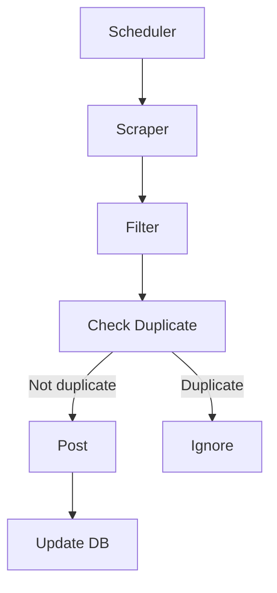

# 📦 Deal Scraper Bot — Requirements & Specification

## 🎯 Objective

Build an automated bot that collects deals from **Dealnews.com**, filters the best opportunities, and publishes them directly to a group, respecting daily limits and permanently avoiding duplicates.

---

## 📌 Project Scope

### Data Source

* Single site: **Dealnews.com**
* Collection via scraping (HTML parsing)

### Publishing

* Destination: Group (e.g., Telegram, WhatsApp, etc.)
* Format: Structured message with title, price, link, and image (when available)

### Limits

* Maximum of **10 deals per day**
* Automatic reset every 24 hours

### Duplicate Control

* No deal should be posted more than once (permanent persistence)

---

### 7. Bot Commands

* `/start` → welcome message
* `/filter` → show active filters
* `/posted` → list posted deals
* `/pause` → pause automation
* `/resume` → resume automation
* `/stats` → bot statistics
* `/reset` → manual reset of the daily limit

---

## ⚙️ Non-Functional Requirements

### Security

* Validation of scraped data (avoid malicious content)
* No storage of sensitive data
* Spam protection (rate limiting)
* Alignment with OWASP Top 10

---

### Performance

* Efficient execution (lightweight scraping)
* Delay between requests (avoid blocking)
* Low memory usage

---

### Reliability

* Automatic retry on failures
* Error logging
* Idempotent execution (no duplicate data)

---

### Observability

* Basic logs:

  * number of deals collected
  * number filtered
  * number posted
* Detailed error logs

---

## 🚀 Overall System Flow

---

## 📦 Tech Stack

* Node.js
* TypeScript
* SQLite (better-sqlite3)
* Axios (HTTP client)
* Cheerio (HTML parsing)
* node-cron (scheduler)

---

## ✅ Definition of Done

* Modular, well-organized code
* Working database with duplicate control
* Active and stable scheduler
* Logs implemented
* Basic tests passing
* Functional deployment (Railway / Render / VPS)
