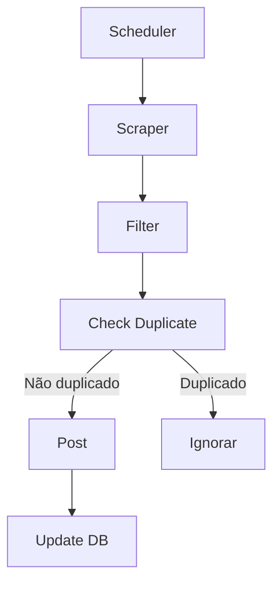

resumo de como foi o uso da ia, primeiro tive uma idea, dps imaginei as ferramentas, depois fui ajustando a ideia para funcionar no mvp para testar a ideia, muito baguca e ate entao surgiu esse documento aqui.

# 📦 Deal Scraper Bot — Requirements & Specification

## 🎯 Objetivo

Construir um bot automatizado que coleta ofertas do **Dealnews.com**, filtra as melhores oportunidades e publica diretamente em um grupo, respeitando limites diários e evitando duplicações permanentes.

---

## 📌 Escopo do Projeto

### Fonte de Dados

* Site único: **Dealnews.com**
* Coleta via scraping (HTML parsing)

### Publicação

* Destino: Grupo (ex: Telegram, WhatsApp, etc.)
* Formato: Mensagem estruturada com título, preço, link e imagem (quando disponível)

### Limites

* Máximo de **10 ofertas por dia**
* Reset automático a cada 24 horas

### Controle de Duplicação

* Nenhuma oferta deve ser postada mais de uma vez (persistência permanente)

---

## 🧩 Requisitos Funcionais

### 1. Coleta de Dados (Scraper)

* Extrair:

  * Título da oferta
  * Preço atual
  * Preço original (se disponível)
  * Link
  * Imagem (opcional)
* Suporte a múltiplas ofertas por execução
* Tratamento de falhas de requisição

---

### 2. Sistema de Filtros

* Filtrar ofertas baseado em:

  * Percentual de desconto
  * Presença de frete grátis
  * Score dinâmico de relevância
* Retornar apenas as melhores ofertas

---

### 3. Controle de Duplicatas

* Armazenar `deal_id` único
* Verificar antes de postar
* Persistência em banco SQLite

---

### 4. Limite Diário

* Contabilizar número de posts por dia
* Bloquear novos posts ao atingir limite (10)
* Reset automático após 24h

---

### 5. Publicação

* Formatar mensagem com:

  * Título
  * Preço atual (com destaque)
  * Preço antigo (tachado, se houver)
  * Link
  * Emojis e badges (ex: 🔥, 💸)
* Enviar com imagem (quando disponível)
* Fallback para texto simples

---

### 6. Agendamento (Scheduler)

* Executar a cada 1 hora
* Pipeline:

  ```
  scrape → filter → deduplicate → post
  ```
* Tratamento de erros (retry/log)

---

### 7. Comandos do Bot

* `/start` → mensagem inicial
* `/filter` → mostrar filtros ativos
* `/posted` → listar ofertas postadas
* `/pause` → pausar automação
* `/resume` → retomar automação
* `/stats` → estatísticas do bot
* `/reset` → reset manual do limite diário

---

## 🗄️ Requisitos de Dados

### Tabela: `posted_deals`

```sql
CREATE TABLE posted_deals (
  id INTEGER PRIMARY KEY AUTOINCREMENT,
  deal_id TEXT UNIQUE NOT NULL,
  title TEXT NOT NULL,
  link TEXT NOT NULL,
  posted_at DATETIME DEFAULT CURRENT_TIMESTAMP
);
```

---

### Tabela: `daily_counts`

```sql
CREATE TABLE daily_counts (
  date TEXT PRIMARY KEY,
  count INTEGER DEFAULT 0
);
```

---

## ⚙️ Requisitos Não Funcionais

### Segurança

* Validação de dados extraídos (evitar conteúdo malicioso)
* Não armazenar dados sensíveis
* Proteção contra spam (rate limit)
* Alinhamento com OWASP Top 10

---

### Performance

* Execução eficiente (scraping leve)
* Delay entre requisições (evitar bloqueio)
* Baixo consumo de memória

---

### Confiabilidade

* Retry automático em falhas
* Logs de erro
* Execução idempotente (não duplicar dados)

---

### Manutenibilidade

* Código modular:

  * `scraper/`
  * `db/`
  * `filters/`
  * `poster/`
  * `scheduler/`
* Tipagem com TypeScript
* Separação de responsabilidades

---

### Observabilidade

* Logs básicos:

  * número de ofertas coletadas
  * número filtrado
  * número postado
* Logs de erro detalhados

---

## 🧪 Critérios de Aceitação

* [ ] Bot coleta ofertas corretamente
* [ ] Filtros retornam apenas ofertas relevantes
* [ ] Nenhuma oferta duplicada é postada
* [ ] Limite diário é respeitado (10/dia)
* [ ] Mensagens são formatadas corretamente
* [ ] Scheduler executa automaticamente
* [ ] Comandos do bot funcionam corretamente
* [ ] Sistema continua operando após falhas

---

## 🚀 Fluxo Geral do Sistema



---

## 📦 Stack Tecnológica

* Node.js
* TypeScript
* SQLite (better-sqlite3)
* Axios (HTTP client)
* Cheerio (HTML parsing)
* node-cron (scheduler)

---

## ✅ Definition of Done

* Código modular e organizado
* Banco funcionando com controle de duplicação
* Scheduler ativo e estável
* Logs implementados
* Testes básicos funcionando
* Deploy funcional (Railway / Render / VPS)

---

## 📎 Observações Finais

* Começar simples e evoluir incrementalmente
* Validar cada módulo isoladamente antes de integrar
* Evitar overengineering no início
* Priorizar clareza e entendimento do código

depois fui pedindo explicacao a cada etapa e implementando funcao por funcao com a ajuda da ia para nao ter nenhuma duvida, quero que resuma esse metodo para eu conseguir replicalo sempre que tiver uma ideia para testar
