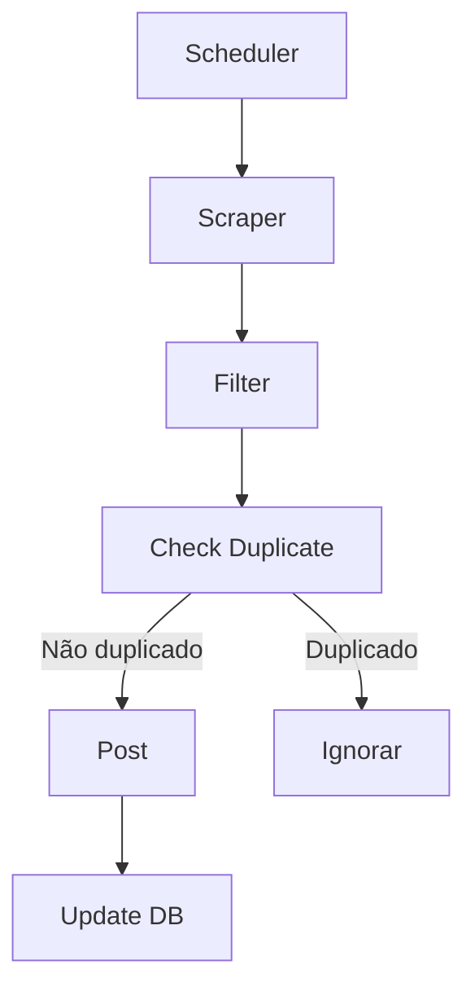

# 📦 Deal Scraper Bot — Requirements & Specification

## 🎯 Objetivo

Construir um bot automatizado que coleta ofertas do **Dealnews.com**, filtra as melhores oportunidades e publica diretamente em um grupo, respeitando limites diários e evitando duplicações permanentes.

---

## 📌 Escopo do Projeto

### Fonte de Dados

* Site único: **Dealnews.com**
* Coleta via scraping (HTML parsing)

### Publicação

* Destino: Grupo (ex: Telegram, WhatsApp, etc.)
* Formato: Mensagem estruturada com título, preço, link e imagem (quando disponível)

### Limites

* Máximo de **10 ofertas por dia**
* Reset automático a cada 24 horas

### Controle de Duplicação

* Nenhuma oferta deve ser postada mais de uma vez (persistência permanente)

---

### 7. Comandos do Bot

* `/start` → mensagem inicial
* `/filter` → mostrar filtros ativos
* `/posted` → listar ofertas postadas
* `/pause` → pausar automação
* `/resume` → retomar automação
* `/stats` → estatísticas do bot
* `/reset` → reset manual do limite diário

---

## ⚙️ Requisitos Não Funcionais

### Segurança

* Validação de dados extraídos (evitar conteúdo malicioso)
* Não armazenar dados sensíveis
* Proteção contra spam (rate limit)
* Alinhamento com OWASP Top 10

---

### Performance

* Execução eficiente (scraping leve)
* Delay entre requisições (evitar bloqueio)
* Baixo consumo de memória

---

### Confiabilidade

* Retry automático em falhas
* Logs de erro
* Execução idempotente (não duplicar dados)

---

### Observabilidade

* Logs básicos:

  * número de ofertas coletadas
  * número filtrado
  * número postado
* Logs de erro detalhados

---

## 🚀 Fluxo Geral do Sistema

---

## 📦 Stack Tecnológica

* Node.js
* TypeScript
* SQLite (better-sqlite3)
* Axios (HTTP client)
* Cheerio (HTML parsing)
* node-cron (scheduler)

---

## ✅ Definition of Done

* Código modular e organizado
* Banco funcionando com controle de duplicação
* Scheduler ativo e estável
* Logs implementados
* Testes básicos funcionando
* Deploy funcional (Railway / Render / VPS)

---

